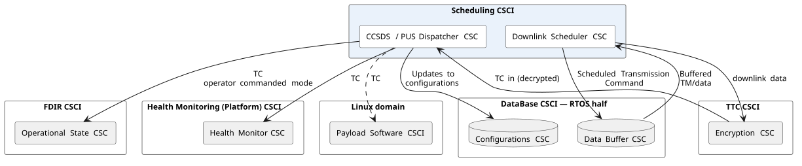
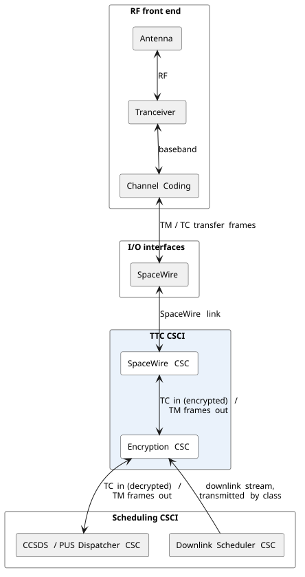
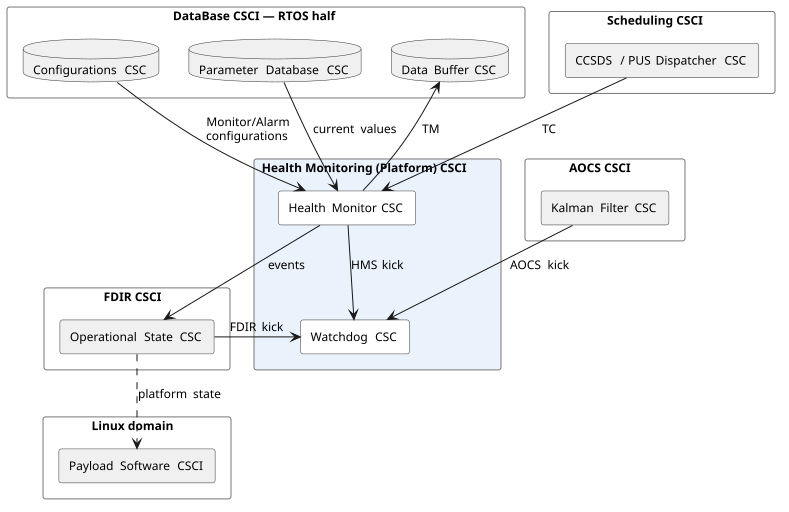
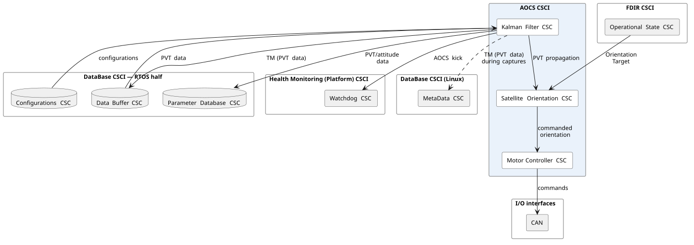
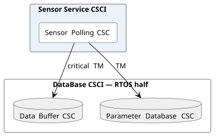
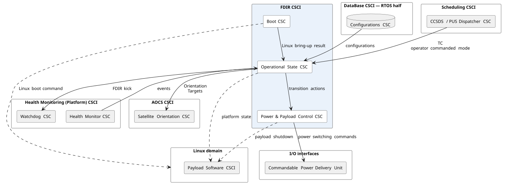
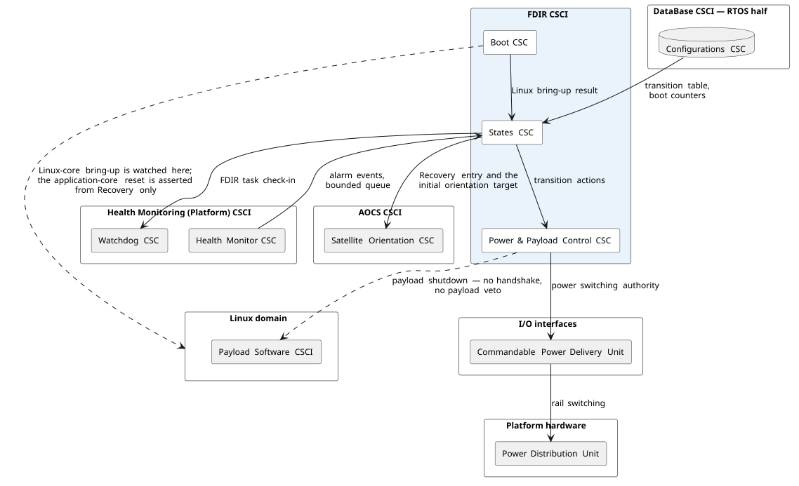
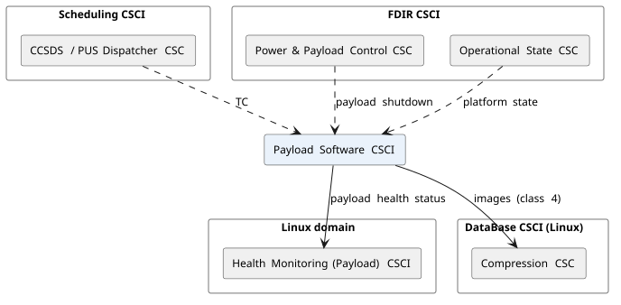
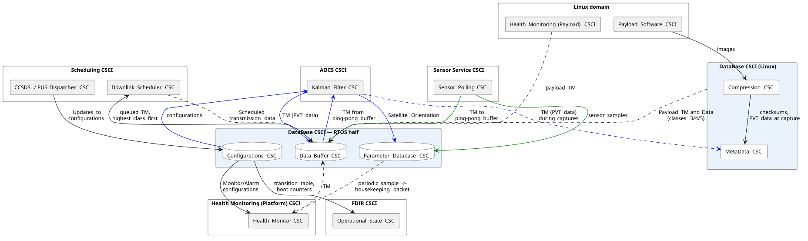

# On-Board Software Architecture


## Building this repo

### In the dev container (recommended)

Needs Docker and the VS Code **Dev Containers** extension. Open the repo and
choose *Reopen in Container*; `.devcontainer/` pins the entire toolchain, so
nothing else has to be installed.

### Build and run

```sh
make config-testdeb
make tgt OBCDemo
```

The demo logs through syslog, which writes to **stderr** - redirect with
`2>&1` if you want to pipe it.

### Tests

```sh
cmake --preset x86-clang -DBUILD_TESTING=ON
cmake --build --preset x86-clang
ctest --preset x86-clang
```

## Problem Statement Brief
The OBC of an upcoming mission has a flight-ready embedded processor, compatible with Linux and FreeRTos. It is tasked with:
1. Scheduling of commands and payload operations
2. Real-time AOCS control
3. Receiving ground commands and routing commands to subsystems
4. Monitoring system health and triggering recovery
5. Buffering payload data until downlink

Create a high-level architecture plan for the Flight Software (FSW) stack that will run on this OBC. Present the resources you need or assume, such as for example I/O interfaces, memory and CPU head-room.
Clear diagrams and architectural explanations are encouraged.

## Assumptions
| # | Assumption & Constraints | Rationale/Justification |
|---|---|---|
| 1 | The processor runs both Linux and FreeRTOS. | Currently I am working on a SoC that has cores isolated to run Embedded Linux and baremetal. I think it's a good cost-saving measure to have a single processor handling both payload and platform.  |
| 2 | Linux Cores are shared with the payload | This is a common weight and cost reduction measure. |
| 3 | The device is a space-grade / radiation-tolerant part. | Memory integrity handling is a software responsibility; see `[ref]`. |
| 4 | **Power and Thermal budget out of scope.** | Unfortunately not an expert. |
| 5 | Single embedded processor indicates one SoC | This impacts redundancy as it is the ONLY processor available, fault tolerance must be answered in Software. |
| 6 | S-band ground link | 10 kbps - 10Mbps data throughput. |
| 7 | VLEO Orbit | Should have a 90 minute orbit time, with some orbits seeing multiple landing stations, and some seeing zero |
| 8 | Signal quality doesn't degrade | This is just to not dive into MODCODs and signal degradations, and reduce sources of error |
| 9 | Imagery mission | Telecommunication satellites have different buffering requirements (packets can be dropped based on a Time To Live). |
| 10 | Image rate | 50 MB per image, 100 images per hour (average). This helps estimate storage requirements (images alone generate 5GB/hour).  |
| 11 | Reliability is prioritized | As much data as possible should be retained in order to transmit when landing stations are next in view |
| 12 | Platform criticality beats payload operations | Self-imposed, and it is the constraint that settles most of the arguments below see `[criticality]`. Where the two compete for CPU, memory, downlink bandwidth or verification effort, the platform wins. |
| 13 | Ground contact is 1 pass per orbit, 6 minutes | 16 orbits/day gives 96 minutes of contact per day`[contacttime]`, which lets me identify if we are able to transmit buffered data `[compression]`. |
| 14 | Required Telemetry generation rates of 32768/4096/1024 bits per second. | Gives a figure to estimate link budget/storage/buffering requirements `[s3]`. |

## Some comments
1. SoC suggestion to contain PL would be to use a versal, it containing one R5 core (could be used to run RTOS), an A72 (embedded linux) and programmable logic (SpaceWire Comms/sensor reading)!

## Sources
`[s1]` CCSDS 122.0-B-2, *Image Data Compression*, Recommended Standard (Blue Book)

`[s2]` ECSS-E-ST-70-41, *Telemetry and telecommand packet utilization* (PUS)

`[s3]` ASCA Project Data Management Plan, telemetry rates - high 32 768 bps, medium 4096 bps, low
1024 bps. <https://heasarc.gsfc.nasa.gov/docs/asca/asca_pdmp/node15.html

`[s4]` CCSDS 355.0-B, Space Data Link Security (SDLS). AES-256 over the transfer frames.

## Domains
### Real-Time Domain
The real time domain is tasked with all the safety critical aspects: scheduling of commands and Payload operations, AOCS Control, Reception and Routing, Health Monitoring (Platform), this is to get the deterministic latency under a real-time operating system, and, isolate a full Linux userspace for the Payload. In this configuration, user-space linux applications would not be able to prevent the real-time aspects to starve or, in the event of having a corruption on a core, prevent regular execution of safety critical tasks.

#### Scheduling CSCI

Owns the time-based command schedule. The schedule consists of both validating packets on receipt, and publishing the time until the next scheduled command. Schedules must also contain the time at which the next downlink (or all downlinks). The payload mission plan and downlink schedule must be stored in a non-volatile, radiation resistant medium (MRAM). Contains the following CSCS:

##### CCSDS/PUS Dispatcher
Dispatching is the notion of sending things out, I have just decided to also add "at the right time" to this. The Dispatcher is required to also schedule Telecommands (TC). A decision has been taken to use CCSDS PUS as their APIDs map easily to CSCIs. Requests for on-demand telemetry are also treated as Telecommands, to minimize the need for other dispatching mechanisms.

##### Downlink Scheduler
This owns the data transmissions, data is categorized in terms of criticality (1/2/3/4/5) see `[data_criticality]` and transmits the buffered data accordingly. Responsible for transmitting the buffered platform and payload data and telemetries.

#### Telemetry and Telecommand (TTC) CSCI

 Owns the connection with the ground. This CSCI corresponds to the transport layer. Contains the following CSCS:

 ##### SpaceWire
 Carries the TTC transfer frames to/from the communications subsystem.

##### Encryption
Suggested for completion's sake. People have demonstrated the ability to already hack satellites, AES-256 is a supported encryption via CCSDS SDLS.

#### Database (full)
This CSCI is split across domains, and is responsible for maintaining the integrity of the database. The full contents of the Database CSCI (rather than just RTOS domain) are indicated. Contains the following CSCS:

##### Data Buffer
Data Buffer exists to store all the different criticalities of data see `[criticality]`. The most critical data is stored in non-volatile, radiation resistance storage (MRAM).  Note: this section shows the whole CSCI, but in the Linux domain I have only added the subset of functionality that is run there.

##### Parameter Database
Table of the current per-parameter latest. This may be stored in DDR with ECC. All data reads pass through this object to standardize interactions with the database in order to ensure reads/writes, timestamping and validity are enforced here rather than the telemetry producer.

##### Configurations
 Configuration parameters of sensors, devices, limits etc. Separated from the Parameter Database as these should only be updated via ground operator commands or updates.

##### Compression (linux)
Assumption of the S-Band antenna with my data-throughput estimations requires the use of compression to meet the throughputs possible during the times we see a landing station. see `[compression]`
##### Metadata (linux)
Storage location for image checksum metadata (class 3) and capture timestamp/positional data (class 5) - small sized data objects that may be transmitted if there are ground link issues.


#### Health Monitoring (Platform) CSCI

Responsible for raising alarms, and ensuring telemetry within required ranges.

##### Watchdog
Exists to kick an external watchdog.

##### Health monitor
A very creative name, it exists to centralize the logic to monitor different telemetries and raise alarms.


#### AOCS CSCI

Real-time attitude control. The loop runs on its own period and pulls its sensor data rather than being invoked when a sample arrives. It relies on the ping-pong buffer to always get the latest data. Contains the following CSCS:
##### Kalman Filter
Within AOCS as the sensor readings should be filtered to ensure integrity of the decisions made. When no samples have arrived, or are stale, the samples are propagated rather than repeating the last measurement, bounded to a fixed number of intervals see `[staleness]`.

##### Satellite Orientation
Owns the satellite's orientation and its substates. Orientation substates exist under Operational. The FDIR state machine commands entry into Operational and specifies an initial orientation target, and AOCS then transitions to it and holds it without further instruction.

##### Motor Controller
Motor commands out over CAN.

#### Sensor Service CSCI

 Sensor acquisition, kept as its own CSCI so the rest of the RTOS domain does not know how the front end is implemented. Contains the following CSCS:
##### Sensor Polling
A thin  shim over the sensor interfaces. This is just to potentially provide a valid platform (and make more money down the road) by putting a small emphasis on code-reuse. If sensor capture moves from hardware to software polling, or the other way, the change stops here and does not propagate.

#### Fault Detection and Interrupt Recovery (FDIR) CSCI

 Final authority (within spacecraft) on operations (may be superseded by operators). Owns the spacecraft mode and is the centralized location for state transitions. Validates the Linux domain has correctly booted. When not in view of a landing station, is the final authority for platform decisions to prioritize orbit recovery and, platform integrity. Responsible for monitoring if the Linux domain has booted.
##### Boot
Responsible for monitoring the linux cores during boot. Failure to come alive is a transition to Recovery, which owns the retry logic.

##### States
The state machine for the satellite see `[operational_states]`. Owns the platform state and must be commanded to transition. When transitioning from one state to another, this CSCI is responsible for enacting the sequence that must be performed. This is a centralised area to hold all the logic regarding states, their transitions and criteria.

##### Power and Payload Control
Centralized location for power switching and shutting down the payload for recovery operations. Kept separate from States deliberately - States decide that a transition happens, this is what actually throws the switches, and I would rather those be two things than one. There is no graceful-stop handshake and no payload veto - a handshake is something that can hang.

### Linux Domain
The linux domain is deliberately set to be simple and lightweight (and out of scope).


#### Payload Software CSCI

 Produces Telemetry (TM), receives TCs from the dispatcher `[TTC]`. Compression and metadata generation run here, in the Linux domain, which is what keeps 120 GB/day (uncompresed) of imagery away from the safety-critical cores.
#### Health Monitoring (Payload) CSCI

 Separate from the Health Monitoring (Platform), this provides an easy way to separate payload by priority.  While reliability is prioritized, not all telemetry is equal. Payload TM is queued as priority 2 rather than priority 3 - payload data is droppable as a last resort, payload health must be higher priority so we can diagnose potential payload problem.

### Database CSCO

This CSCI is split across domains, and is responsible for maintaining the integrity of the database. In this domain we have the following CSCs.

##### Compression
Assumption of the S-Band antenna with my data-throughput estimations requires the use of compression to meet the throughputs possible during the times we see a landing station. see `[compression]`

##### Metadata
 Storage location for image checksum metadata (class 3) and capture timestamp/positional data (class 5) - small sized data objects that may be transmitted if there are ground link issues.

It contains the Payload Software CSCI acting as a receiver for buffered payload operations and creates Telemetry (TM).

## Components

There is no software bus, services inside the platform processor communicate via callbacks, across domain barriers we use a shared-memory buffer (CoTS exists for this).

### Data Model

| Direction | Use when | Mechanism(s) | Example |
|---|---|---|---|
| Pull | Used when a consumer of this data has its own period or must sample current states. Producers hold the most recent value and consumers may decide when to use that data. | The ping-pong buffer exists to provide method to ensure high-rate or "important" telemetry with a dependency on freshness. The parameter database exists to buffer less important telemetries and it is emptied on transmission (pulled) from the storage. | Sensors to AOCS control loop, critical TM |
| Push | The event is the trigger, consumers must act on it as soon as realistically possible. | Callback, backed by a bounded queue where delivery has to be guaranteed. | Events, anomaly reports, commands, TM into the Data Buffer |

Pulls are used mostly in the control loops, and exists to minimize jitter in arrival time, this helps our timing analysis by giving us a simplification of "how long does it take to get a value from the ping-pong buffer".

Push are when events occur and must be delivered promptly. In this case polling for critical events are wasteful and could arrive late.

Callbacks are the default, a queue is only used where delivery has to be guaranteed. A callback is a
call, so it cannot buffer - if the consumer is not ready the data is gone. That is fine on a pull
path where the next value supersedes the last, and not fine for an anomaly report.

#### Generalization of usage
| Buffer Used | Typical Contents |
|---|---|
| Ping-Pong Buffer | Critical Telemetry |
| Parameter DB | Non-Critical Telemetry |
| Bounded Queue | Alarm Events |

### Examples per path

| Path | Direction | Mechanism | What happens under pressure |
|---|---|---|---|
| Sensor Polling to AOCS | Pull | Ping-pong (double) buffer. The producer overwrites the eldest entry and swaps the index atomically on completion. The control loop reads the active half on its own period. | Overwrite eldest sample on write, read last fully written. Producers never block, consumers never wait. |
| Any service to TM | Pull | Services write their current values, Health Monitoring samples periodically to build the housekeeping packet. | Nothing, it is only sampling values rather than decision making or delivering. Parameters are all independent and the latest 'wins'. |
| Health Monitoring to FDIR | Push | Callback into a bounded queue per consumer | Overflows raise event(s). Events (and commands) are never dropped without notification or feedback. |
| TM producers to Ground | Push | Producers add to buffer, the downlink scheduler starts to transmit (and empty)  during a scheduled pass (or landing stage is visible). | Priority classes see `[criticality]` |
| RTOS domain to Linux domain | Push | Shared memory with an interrupt to notify | Non-blocking on the RTOS side, a full or unserviced channel is a reported fault. see `[criticality]` |

`[caveat2]`
A double buffer is only enough if consumers finish reading the index before the producer can write to it again. In other words, we must ensure that producers do not write two samples while the consumer is reading the first (C starts read of 0, P writes Idx 1, swaps index to 0, P starts writing to 0). With a periodic AOCS task and a known sensor rate that is something that becomes testable and validated. If the margin turns out to be thin a third buffer may be added at the cost of more memory use.

`[staleness]` Buffers always contain something in it (if the sensors have provided data). A stalled sensor that hasn't reported data could be mistaken for being new. Consumers must be able to distinguish a new sample from the one it had previously consumed. If no new sample arrives, the Kalman Filter propagates the state (only for a few polling intervals) rather than re-using the last measurement. If the propagation interval exceeds a fault has occurred - propagation may still continue but at the risk of drifting further off the mark.

## Criticality `[criticality]`
### General Paradigm
The platform is safety-critical and the payload isn't.
- The payload may never block the platform. A crashed, resource hogging Linux instance is a fault that the RTOS domain must be separate to. No functionality of the platform should depend on the Linux side. When competing for resources, the platform comes first, especially for CPU, memory, downlink bandwidth. Payloads (images) and Payload telemetry can always be retaken, but ensuring the health of the platform is paramount.
- No safety critical paths depend on linux, all safety critical aspects (control loops, FDIR decisions, operational state actions) must be deterministic in time.
- FDIR has authority on the payload power state - in the event the Payload is misbehaving it may be turned off.

### The downlink queue

### Telemetry classes
`[data_criticality]`
| Class | Contents | Transmission / drop behaviour |
|---|---|---|
| 1 | Events, anomaly reports, FDIR actions taken | Transmitted first. Never dropped. |
| 2 | Platform and payload housekeeping TM | Transmitted second. Never dropped, but may be buffered or fragmented to send during subsequent orbits. |
| 3 | Critical image regions (checksums) | Transmitted after class 2. Not droppable. |
| 4 | Non-critical image regions (pixel data)| Transmitted after class 3. Droppable (when satellite in jeopardy), and it is the release valve that keeps the class 1, 2,3 guarantees honest. |
| 5 | Non-critical image metadata (capture timestamp, positional data )| Transmitted after class 4, if link allows or is required. |

In order to prioritize reliability and the reception of traffic, generated TM is queued for transmission and is not transmitted as soon as it is produced. Since we only see the landing station for a brief time during an orbit, the large majority of telemetry is generated without being able to be transmitted. Telemetry is stored rather than dropped (or transmitted immediately) because faults have a higher likelihood of happening when the satellite is not in view of a landing station. When this occurs, it's important to be able to in-orbit troubleshoot and determine causes, as such, telemetry retention ensures that the sequence of events is at least able to be traced to how it occured and why the fault records and telemetries are transmitted in priority vs payload data.

Splitting image data versus two types of metadata reflects what can be safely dropped. Checksums must be retained so that any image data which does arrive can be verified as uncorrupted, while image metadata regarding positioning can be inferred through received telemetry. While difficult it is not impossible, which is why the image itself is more valuable than its metadata — the metadata is the part that can still be recovered after the fact. Special care must be taken for payload storage, the Databases must be large enough to ensure that all the different classes of data may be retained for a reasonable amount of time before being dropped. A mission-wide level decision must be taken here.

## Operational states
`[operational_states]` Owned and executed by the Operational State CSC inside FDIR. It holds the state, transitions, and actions each transition must perform.

| State | Purpose |
|---|---|
| Boot | Boot-up logic and sensor bring-up. Interfaces are in a bring-up state. RTOS domain polls here for the Linux domain coming up. On failure, this state transitions to Recovery, which retries booting the Linux domain. |
| Operational | Nominal operation, actively working. Holds the orientation modes as substates. Orbital passes are entered by a scheduled transmission command which transitions here. Image captures occur here as well. |
| Standby | Nominal but idle, waiting for a scheduled command's execution time. Payload is idle; AOCS drops to rate-damping only rather than holding a fixed orientation. Payload compression runs. |
| Maintenance | Image uploads, parameter patches, in-orbit troubleshooting. State transitions are restricted during patching so a transition cannot happen mid-write, preserving data-transfer integrity. |
| Platform Only | Payload domain shut down, platform survives. |
| Recovery | Event recovery must occur (or is in progress). Ex: FDIR actively attempting full recovery due to tumbling. Also occurs when the Linux domain fails to come alive. This is the only state in which the RTOS domain takes the master role and may assert resets over the application cores. |

What each state implies falls out of the definitions plus the criticality ordering:

| State | Payload domain | TM classes generated |
|---|---|---|
| Boot | Not started | 1 |
| Operational | Running | 1, 2, 3, 4, 5 |
| Standby | Idle or reduced | 1, 2, reduced 3 (compression/grooming backlog only - no new 4 or 5) |
| Maintenance | Idle, no data production | 1, 2 |
| Platform Only | Shut down | 1, 2 |
| Recovery | Shut down | 1, 2 |

### AOCS behaviour by state

| State | AOCS behaviour |
|---|---|
| Boot | Bring up. System is initializing, no closed-loop pointing control yet as sensor reads could be erroneous. |
| Operational | Actively holding the current satellite orientation, including the holds needed for image capture. |
| Standby | Rate-damping only. Must reacquire and settle to the next target orientation before leaving Standby, gated by the imager's warm-up time. |
| Maintenance | Attitude control never stops, even though autonomous state transitions are restricted. |
| Platform Only | AOCS keeps running independently of the payload domain being shut down. |
| Recovery | Recovery control law - a dedicated law (e.g. detumble) takes over in place of nominal satellite orientation control. |

Classes 4 and 5 stop being produced as soon as the payload goes idle. Class 3 continues until the payload domain is fully down (Maintenance, Platform Only, or Recovery), which is where the downlink queue empties the quickest.

Operational and Standby are entered and left autonomously, driven by the mission plan and gated on the payload's warm-up time:

```
idle = t(next scheduled payload command) - t(now, after current scheduled work completes)

enter Standby   when  idle > T_warmup
leave Standby   at    t(next scheduled payload command) - T_warmup
```

Three sources command satellite orientation: FDIR, ground commands and the schedule. Ground outranks FDIR, FDIR outranks the stored plan. An orientation command from a lower priority source while a higher one is controlling the orientation is rejected and reported as an event.

## Compression and what the link can actually carry
`[compression]` Image compression is assumed, to CCSDS 122.0-B-2 `[s1]`.

From the assumptions, we can derive 96 minutes of contact per day. In the S-band range:

| S-band rate | Capacity/day | Class 1+2 share | Payload left | Required ratio |
|---|---|---|---|---|
| 10 Mbps | 7.2 GB | 4.9% | 6.85 GB/day | approximately 17:1 |

### Supporting calculations:

```
Capacity per day = (link rate × contact time) / 8 bits-per-byte
                  = (10 Mbit/s × 96 min × 60 s/min) / 8
                  ≈ 7.2 GB/day
```

- Class 1 and 2 telemetry runs at 32768 bps all day: 32768 bps × 86400 s/day ≈ 354 MB/day. This is 354 / 7200 × 100 ≈ 4.9% of the total bandwidth capacity per day.

Thus we have 7.2 GB − 354 MB ≈ 6.85 GB/day available for payload data.

Compression ratio = 120 GB / 6.85 GB ≈ 17.5:1

| Link condition | Rate mode | What is transmitted |
|---|---|---|
| 10 Mbps, nominal pass | High, 32 768 bps | Class 1, 2, 3, 4, 5 at 17:1 |
| approximately 1 Mbps, degraded | Medium, 4096 bps | Class 1, 2, 3. 4 and 5 deferred to the next good pass |
| 100 kbps or below, marginal | Low, 1024 bps | Class 1 and fragmented class 2 only |


## Resources
### I/O interfaces
`[TTC]` TC arrives over SpaceWire, through the Encryption CSC if it is fitted, and is routed by the
dispatcher on its PUS service. TM goes back out the same way.

| Interface | Required for | Owning software | Status |
|---|---|---|---|
| SpaceWire | Ground link to the communications subsystem | TTC / SpaceWire CSC | Specified |
| CAN | AOCS actuator commands | AOCS / Motor Controller | Specified, variant TBC |
| SPI | Sensor acquisition Magnetometers, temperature sensors, Star tracker, GPS receiver |Sensor Polling, via the front end | Specified |
| GPIO | Watchdog kick, sensor enable/disable | Health Monitoring / Watchdog | Specified |
| QSPI | MRAM access, boot | Platform | Specified |
| DDR (ECC) | Working memory both domains, and the Parameter Database current values | Database / Parameter Database. ECC error counters exposed to Health Monitoring | Specified |
| MRAM | Non-volatile store - configuration, persistence state, boot image | Platform | Specified |
| Commandable Power Delivery Unit | FDIR's power switching authority | FDIR / Power and Payload Control | Required, not yet specified |
| JTAG | Debug | - | Development only |

### Memory
| Store | Holds | Sizing driver | Estimate |
|---|---|---|---|
| DDR, Linux domain | Kernel, rootfs, payload software and its working set | The payload's own requirement, a general purpose userspace is the floor | A few GB, payload-driven, TBD |
| DDR, RTOS domain | FreeRTOS working set, task stacks, bounded queues, Parameter Database current values, shared-memory buffers | Task count times stack, plus queue depths. The current-value table is small - a few hundred parameters of a few words each is tens of KB | 1 GB |
| MRAM | Platform boot images (Primary, Secondary, and Golden), configuration, persistence state, the command schedule | Dominated by the FreeRTOS image, tripled across the primary, secondary, and golden copies | See below |
| Mass memory | Downlink queue backing store | The queue calculation, derived from the image rate and the contact schedule | About 4 GB covers a 12 hour outage with everything compressed at 17:1. 1-2 GB covers the realistic 2-4 orbit case |

Note: MRAM is known to be very expensive but the trade-off of being non-volatile and radiation hardened are worthwhile tradeoffs. Some extra calculations must be made to ensure all 3 boot-image copies (Primary / Secondary / Golden) fit on MRAM.

### CPU headroom
Requires hard metrics and calculations. What I currently have is that the headroom should be calculated against the operational state with, a fault in progress and is in contact with the ground.  This is in my eyes, something that is realistically occurrable. Common wisdom indicates 50% headroom for the design stage.

## Fault tolerance
A single SoC means no hardware redundancy, so fault tolerance is answered in software. In order to minimize having single points of failure an external watchdog should be added with the OBC kicking it. An internal watchdog can't be kicked by a hung core, since that core is exactly what it's meant to catch. Letting the payload handle the watchdog kick in this case would let the payload reset the platform which violates the constraints I've set forth at the beginning of the document.

Recovery from a failed Linux boot is a bounded ladder rather than an indefinite retry. The Primary and Secondary images must both be tried before falling back to the Golden image; if the Golden image is also unsuccessful, the platform enters Platform Only.

## Status

### Demo Presence
| # | Task | CSCI | Component (under /lib), demo status |
|---|---|---|---|
| 1 | Scheduling of Commands & Payload Operations | Scheduling CSCI | N/A, not implemented |
| 2 | AOCS control | AOCS CSCI| AOCS/Rate Damper, Implemented |
| 3 | Reception and Routing | TTC CSCI | N/A, not implemented |
| 4 | Health Monitoring | Health Monitoring CSCI | HMS, implemented |
| 5 | Buffering payload data | DataBase CSCI | Databases/PingPongBuffer, Databases/TelemetryDB, Implemented |

Demo coded in C++ using C++23 - as I am using it in my home projects with a fully self built build-system. I prioritise the use of self-made algorithms rather than Commercial off the Shelf (CotS) as I am prioritising my learning/improvement in design and coding.
